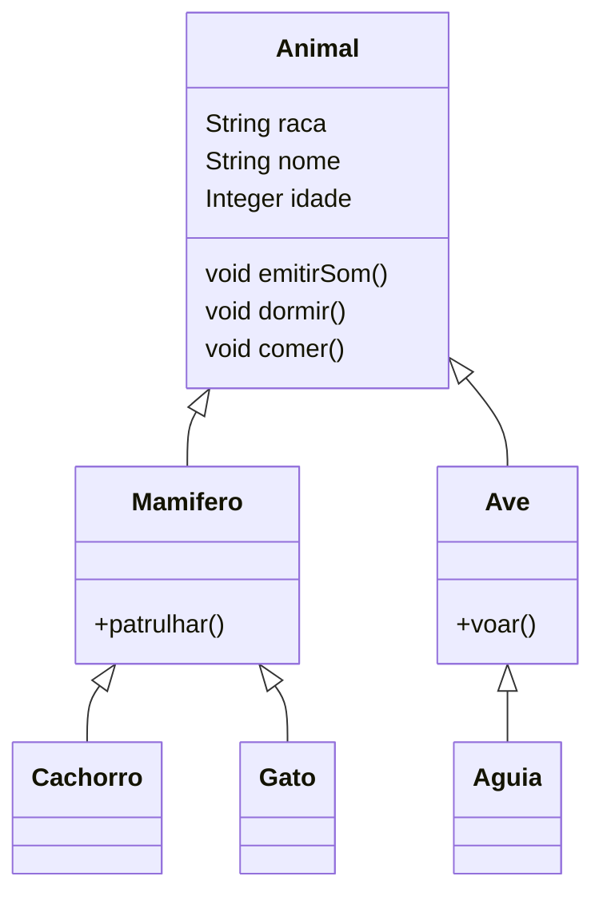

# Programação Orientada a Objetos

## Básico da POO

### Qual seria a principal tabela do software de controle de Estoque?

# Abstração: Olhar para o mundo real e definir um "Mini Mundo"

## Cachorro

1. Sexo
2. Idade
3. Cor
4. Raça
5. Nome
6. Alergia
7. Patologia
8. Peso
9. Espécie
10. Tutor

> Uma classe é uma estrutura que define atributos e
> compotamentos

