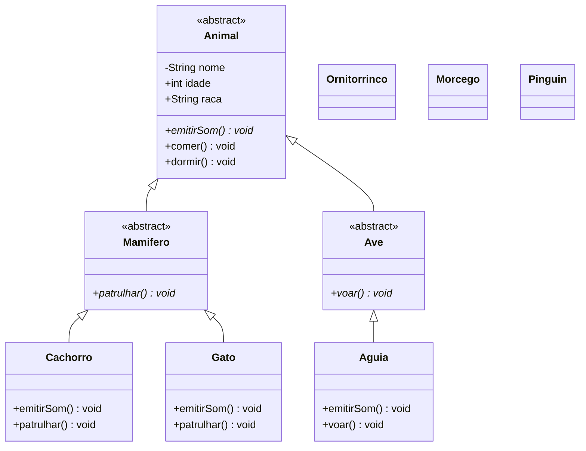

# Programação Orientada a Objetos

## Básico da POO

### Qual seria a principal tabela do software de controle de Estoque?

# Abstração: Olhar para o mundo real e definir um "Mini Mundo"

## Cachorro

1. Sexo
2. Idade
3. Cor
4. Raça
5. Nome
6. Alergia
7. Patologia
8. Peso
9. Espécie
10. Tutor

> Uma classe é uma estrutura que define atributos e
> compotamentos

## Atividade: implementação do diagrama de herança

O diagrama abaixo representa a hierarquia que deverá ser implementada no pacote
`model`. Algumas partes já existem no código e outras deverão ser criadas ou
adequadas pelos alunos. A seta com o triângulo aponta da classe filha para a
classe mãe. Por exemplo, `Animal <|-- Mamifero` representa
`Mamifero extends Animal`.

### Instruções

1. Analise como a classe `Cachorro` foi adequada para herdar de `Mamifero`. Use
   essa implementação como referência para as próximas etapas.
2. Compare a classe `Gato` com o diagrama. Altere sua herança para que ela seja
   uma especialização de `Mamifero` e implemente todos os métodos abstratos que
   passar a herdar.
3. Crie a classe abstrata `Ave` como uma especialização de `Animal`.
4. Declare em `Ave` o comportamento abstrato `voar()`. Como `Ave` também herda
   o método abstrato `emitirSom()`, ela deve permanecer abstrata.
5. Crie a classe concreta `Aguia` como uma especialização de `Ave`.
6. Implemente em `Aguia` os métodos `voar()` e `emitirSom()`, usando mensagens
   adequadas ao comportamento da ave.
7. Crie construtores para `Ave` e `Aguia` que recebam `nome`, `idade` e `raca`.
   Encaminhe esses valores à superclasse com `super(...)`, seguindo o exemplo
   das classes existentes.
8. Use `@Override` em todos os métodos que implementam ou sobrescrevem um
   comportamento herdado.
9. No método `main`, instancie um `Gato` e uma `Aguia`. Chame seus comportamentos
   para conferir se as implementações funcionam.
10. Ao terminar, compare novamente o código com cada seta do diagrama e
    confirme que todas as relações de herança foram implementadas.
11. O Orinitorrinco é um mamífero que bota ovos. Crie a classe `Orinitorrinco` como uma especialização de `Mamifero`. Implemente os métodos abstratos herdados e adicione um método específico chamado `botarOvo()`.
12. O Morcego é um mamífero que voa. Crie a classe `Morcego` como uma especialização de `Mamifero`. Implemente os métodos abstratos herdados e adicione um método específico chamado `voar()`.
13. O pinguin é uma ave que não voa. Crie a classe `Pinguin` como uma especialização de `Ave`. Implemente os métodos abstratos herdados e adicione um método específico chamado `patrulhar()`.

As classes `Aluno` e `Tutor` não fazem parte dessa hierarquia, pois representam
outros conceitos do sistema.
